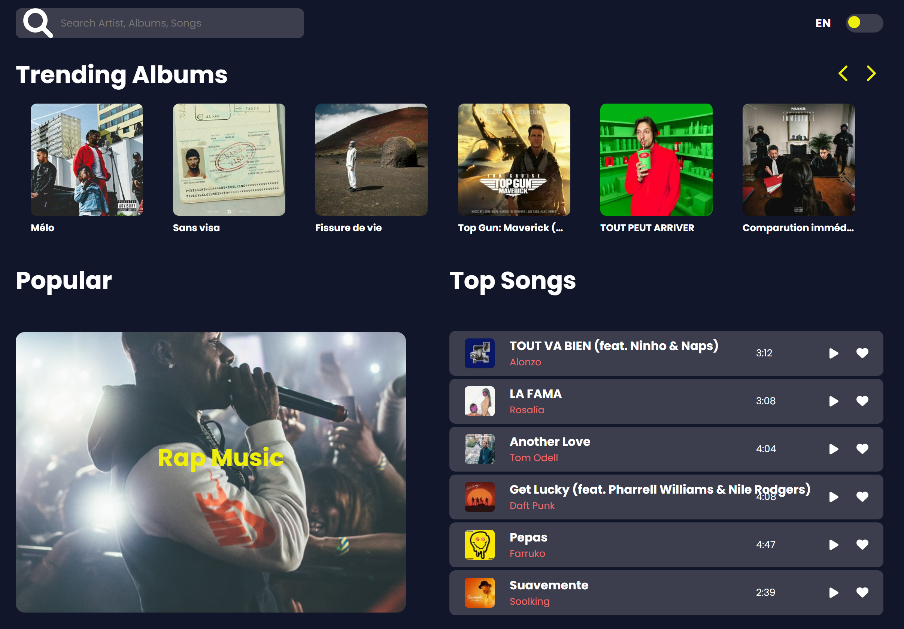

<div id="top"></div>

<!-- PROJECT LOGO -->
<br />
<div align="center">
  <a href="https://github.com/Dimitri-Enjelvin/DeezerApp">
    
  </a>

  <h3 align="center">Deezer App by Dimitri.E</h3>

  <p align="center">
    An awesome React App build on top of the Deezer API
    <br />
  </p>
</div>


<!-- TABLE OF CONTENTS -->
<details>
  <summary>Table of Contents</summary>
  <ol>
    <li>
      <a href="#about-the-project">About The Project</a>
      <ul>
        <li><a href="#built-with">Built With</a></li>
      </ul>
    </li>
    <li>
      <a href="#getting-started">Getting Started</a>
      <ul>
        <li><a href="#prerequisites">Prerequisites</a></li>
        <li><a href="#installation">Installation</a></li>
      </ul>
    </li>
    <li><a href="#usage">Usage</a></li>
    <li><a href="#roadmap">Roadmap</a></li>
    <li><a href="#contributing">Contributing</a></li>
    <li><a href="#license">License</a></li>
    <li><a href="#contact">Contact</a></li>
    <li><a href="#acknowledgments">Acknowledgments</a></li>
  </ol>
</details>


<!-- ABOUT THE PROJECT -->
## About The Project


<div align="center">
    
</div>


This is a small project, built in a week using public API such as Deezer API and LastFM API to get data from songs and artists.
I basically started to build it as a test for a job interview and i ended up digging deeper, creating more features and making this small project a real and complete App.


<p align="right">(<a href="#top">back to top</a>)</p>


### Features

What can you do with this app you ask ?

- [x] : You can search for tracks by name using the Deezer API
- [x] : You can check top artists, albums and tracks directly from the home page
- [x] : You can access albums, artists, tracks and even radios sorted by type and gender
- [x] : You can access to single pages for each artist, album and track
    - [x] : Each of this page contain informations such as albums, related artists, name, number of followers and more...
    - [x] : Each artist's page contain a biography we display thanks to the LastFM API
- [x] : You can follow artists, like tracks and find them later in your library
- [x] : You can play a track preview and listen to your favorite song
- [x] : You can choice between a 'dark' or 'light' theme for the app 


### Built With

* [React](https://reactjs.org/)
* [Redux](https://redux-toolkit.js.org/)
* [Axios](https://axios-http.com/)
* [Font Awesome](https://fontawesome.com/)
* [React i18next](https://react.i18next.com/)

<p align="right">(<a href="#top">back to top</a>)</p>


<!-- GETTING STARTED -->
## Getting Started

Please follow theses steps as you install this project locally.

### Prerequisites

No particular prerequisites are required. You just need to have a computer and a connection.

### Installation


1. Clone the repo
   ```sh
   git clone https://github.com/Dimitri-Enjelvin/DeezerApp.git
   ```
3. Install NPM packages
   ```sh
   npm install
   ```
4. Run the project`
   ```sh
   npm start
   ```

<p align="right">(<a href="#top">back to top</a>)</p>


<!-- USAGE EXAMPLES -->
## Usage

This project is for education purposes only, cannot be used elsewhere. 

_This is a test for an interview


<p align="right">(<a href="#top">back to top</a>)</p>


<!-- ROADMAP -->
## Roadmap

- [ ] Change tracks rows
- [ ] Add playlists feature
- [ ] Handle better play track preview => one is playing === others stop
- [ ] Add 'For you' feature => personalized recommendations
- [ ] Add like albums feature
- [ ] Modify bottom navbar for mobile device
- [ ] Handle small responsive issues
- [ ] Multi-language Support
    - [x] English
    - [ ] French

See the [open issues](https://github.com/Dimitri-Enjelvin/DeezerApp/issues) for a full list of proposed features (and known issues).

<p align="right">(<a href="#top">back to top</a>)</p>


<!-- LICENSE -->
## License

Distributed under the MIT License. See `LICENSE.txt` for more information.

<p align="right">(<a href="#top">back to top</a>)</p>


<!-- CONTACT -->
## Contact

Dimitri-E - dimitri.enjelvin@gmail.com

Project Link: [https://github.com/Dimitri-Enjelvin/DeezerApp]

Don't hesistate to contact me if you have any questions or run into an issue while testing or installing the project.

<p align="right">(<a href="#top">back to top</a>)</p>


<!-- ACKNOWLEDGMENTS -->
## Acknowledgments

Use this space to list resources you find helpful and would like to give credit to. I've included a few of my favorites to kick things off!

* [ReadMe Template](https://github.com/othneildrew/Best-README-Template)
* [Images](https://www.pexels.com/)
* [React i18next](https://react.i18next.com/)
* [Font Awesome](https://fontawesome.com)

<p align="right">(<a href="#top">back to top</a>)</p>